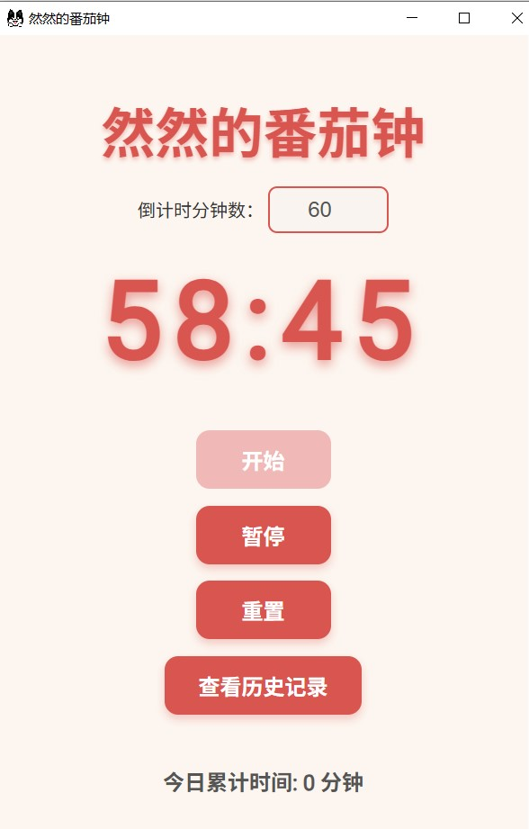

# 🌱一个简单易用的番茄钟


一个 **简单易用、颜值清新** 的番茄钟应用，基于 [Electron](https://www.electronjs.org/) 构建，支持番茄工作法计时、历史记录自动统计等功能，适合日常学习、专注工作使用。



---

## ✨ 功能亮点

- ⏱ 自定义倒计时（默认 25 分钟）
- ✅ 开始 / 暂停 / 重置 操作方便
- 📊 自动记录每日累计专注时间
- 📅 支持查看历史记录
- 💾 使用本地 `localStorage` 保存记录

---

## 🧱 技术栈

- [Electron](https://www.electronjs.org/) - 桌面端应用框架
- HTML + CSS + JavaScript - 前端页面和逻辑
- 本地存储（`localStorage`） - 数据保存

---

## 📦 安装与打包

### 1. 克隆项目

```bash
git clone https://github.com/BigFaceMan/timer.git
cd timer
```

### 2. 安装依赖

先安装npm，一个包管理工具，然后在timer目录下进行下面操作

```
npm install
```

### 3. 启动开发模式

```
npm start
```

### 4. 打包发布（Windows）

你可以使用 `electron-packager`：

```
npm run pack
```

打包成功后会在 `dist/` 目录生成可执行程序（如 `ranra-timer-win32-x64`）。

> ⚠️ 确保你已将 `icon.ico` 放在 `assets/` 目录下，并在 `package.json` 的脚本中正确设置路径：
>
> ⚠️ npm install 下载失败，可以切换镜像源

